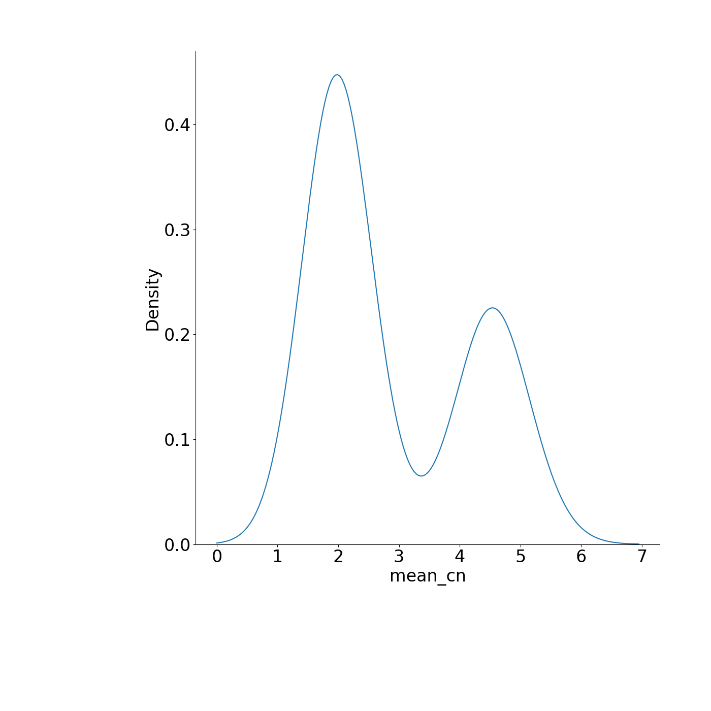
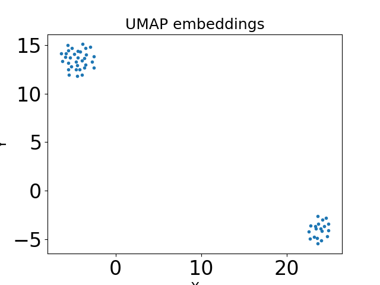
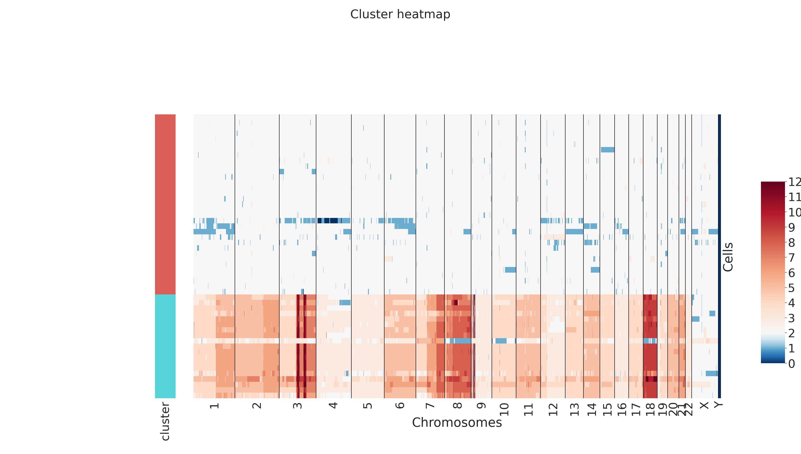
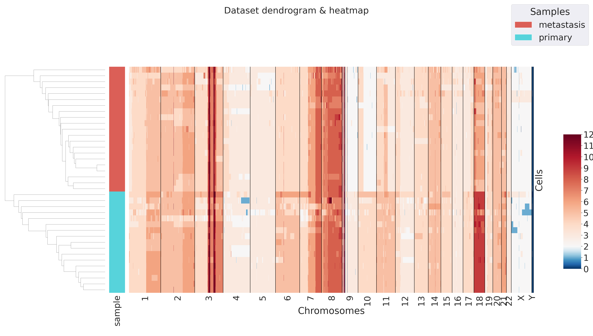

# PhyliCS
A Python library to explore scCNA data and quantify spatial tumor heterogeneity

## Requirements

- python >=3.7, <3.9
- numpy>=1.19.5
- scipy>=1.6.0
- pandas>=1.1.3 
- matplotlib>=3.3.1
- seaborn>=0.11.1 
- scikit-learn>=0.24
- statsmodels>=0.12.0
- anndata>=0.7.5 
- typing
- umap-learn>=0.4.6
- IPython>=7.19.0
- hdbscan>=0.8.26
- joblib>=1.0.0
- gcc

## Installation and setup instructions
Before going into the installation details, please notice that at the end of this guide is a [Troubleshooting](#troubleshooting) section. If you meet any problem during the installation of the library or its usage, please, take a look to that section because you may find the solution. 

If none of the proposed solutions work for you, feel free to contact the author of the library by email (marilisa.montemurro@polito.it).
### Python requirements
For library dependency issues, PhyliCS works with Python >= 3.7 but < 3.9 . So if you do not have a working installation of Python 3.7.X, consider installing Miniconda (see [Miniconda](https://docs.conda.io/en/latest/miniconda.html) website) to create a clean environment to work with PhyliCS.

To create an enviroment named `py37` with a fresh Python 3.7 installation, run:
```
conda create --name py37 python=3.7
```

Then, you can activate the new enviroment by typing:

```
conda activate py37
```

### PhyliCS installation from PyPI

PhyliCS is distributed via PyPi. To install it run:

```
pip install phylics
```

Dependencies are checked by `pip` and missing packages are automatically downloaded and installed.

### PhyliCS installation from Bioconda

Add Bioconda channel:

```conda config --add channels bioconda```

Create an environment containing PhyliCS and all its dependencies and activate it:

```
conda create --name phylics phylics
conda activate phylics
```

## Usage
To test the library, open the Python interprete and import it:
```
>>> import phylics
```

If you do not get any error message the library has been properly installed. 

### Input data format
Sample data need to be put in a tab-delimited matrix where:
- the first three columns contain the coordinates of fixed genome regions on which CNV are computed (bins)
- all other columns contain the copy-numbers of all cells for all bins

This is toy example of an input file containing the information about 5 cells and 8 genomic regions on chromosome 1:
| CHR  | START   | END     | SRR089523 | SRR089526 | SRR089529 | SRR089533 | SRR089542 | 
| ---- | ------- | ------- | --------- | --------- | --------- | --------- | --------- |
| chr1 | 1       | 755628  | 2         | 2         | 2         | 1         | 6         |
| chr1 | 755627  | 830534  | 2         | 2         | 2         | 1         | 6         |
| chr1 | 830533  | 883047  | 2         | 2         | 2         | 1         | 6         |
| chr1 | 883046  | 934413  | 2         | 2         | 2         | 1         | 6         |
| chr1 | 934412  | 985836  | 2         | 2         | 2         | 1         | 6         |
| chr1 | 985835  | 1038768 | 2         | 2         | 2         | 1         | 6         |
| chr1 | 1038767 | 1091208 | 2         | 2         | 2         | 1         | 4         |
| chr1 | 1091207 | 1142489 | 2         | 2         | 2         | 1         | 4         |

Pay attention: cell genomes need to be binned in the same way (same number of bins, same starting and ending points), in order to be correctly processed by PhyliCS. 

### Dataset loading and exploring

In order to test PhyliCS functionalities with a pre-formatted file, you use one of the files we provided through the [repository](https://github.com/bioinformatics-polito/PhyliCS_usage) we prepared to allow to reproduce paper results (see [Case studies](#case-studies)). Just clone the repository (`git clone https://github.com/bioinformatics-polito/PhyliCS_usage`) and pick one of the case studies available in one of the subfolders of the folder `data`.

For this tutorial, we use lung tumor data. You can find them at:
```
PhyliCS_usage/
├── data
│   └── lung
│       ├── metastasis
│       │   ├── results.txt
│       │   └── SegCopy
│       └── primary
│           ├── results.txt
│           └── SegCopy
```
We start by loading CNV data of the primary tumor into an instance of the class 'phylics.Sample':
```
>>> navin_prim = phylics.Sample.from_file("PhyliCS_usage/data/lung/primary/SegCopy", sample_name="primary")
```

You can check the content of the CNV matrix by typing:
```
>>> navin_prim.get_cnv_dataframe() #returns a pandas.DataFrame
```
or
```
>>> navin_prim.get_cnv_matrix() #returns a numpy.ndarray object

```

Then, we may add some annotations. Annotations are aggregated features of both cells and bins. For example, we may add the information about the mean copy-number for each cell. This information can be found in the `results.txt` file, which is available at the same position where the CNV data are stored. So we can load that information and attach it to our sample object as an annotation:

```
>>> import pandas as pd
>>> df = pd.read_csv("PhyliCS_usage/data/lung/primary/results.txt", sep="\t", index_col=0).dropna()
>>> ploidy = df['Copy_Number']
>>> navin_prim.add_annotation(ploidy, "mean_cn")
```

We may also compute the median absolute deviation (MAD) for each CNV profile, by invoking:

```
>>> navin_prim.mad()
```

In this case, the MAD of each cell is automatically attached as an annotation to the sample object.

We could also compute some annotations on the bins. For example, we may be interested on identifying the highly variable features and storing this information as a boolean annotation. It can be done by running:

```
>>> navin_prim.variable_features()
```

You can explore the annotations you have loaded/computed on you sample by typing:
```
>>> navin_prim.get_annotations("obs") #obs to get the cell annotations, feat to get the bin annotations
            mean_cn     mad
SRR089523   2.90        0.746891
SRR089526   1.70        0.439316
SRR089529   1.85        0.237948
SRR089533   1.80        0.338593
SRR089542   5.00        1.420739
...         ...         ...
SRR089697   4.45        1.376622
SRR089698   4.40        1.411748
SRR089699   4.30        1.287423
SRR089700   4.35        1.509005
SRR089701   4.25        1.484096
SRR089702   4.20        1.350496
```
This command returns a `pandas.DataFrame` which index correspondS to the cells/bins while the each columns store the annotations.

We may look at the distribution of the annotations. For example, you may be interesting in the distribution of the mean copy-number over the dataset and try to identify clusters. In that case, you need to run:
```
>>> navin_prim.plot_annotation_dist("mean_cn", outpath="ploidy.png", kind="kde", figsize=(7,7))
```


In this case, it is evident that the dataset is made of two major group of cells, characterized by a mean CN ≈ 2 and a mean CN ≈ 4.5, respectively.

### Clustering
Before clustering CNV data, we perform dimensionality reduction using only highly variable features to mitigate the negative impact of the curse of dimensionality. Run:
```
>>> navin_prim.umap(use_highly_variable=True)   #use_highly_variable=False to use all features.
```
To visualize UMAP embeddings, run:

```
>>> navin_prim.plot_umap(outpath="umap.png") #if you do not specify any output path, the plot is shown in interactive mode
```



Finally, you can cluster your data, choosing one of the available clustering algorithms.

Specifically, you can choose among:

| Method  | PhyliCS denomination   | 
| ---- | ------- | 
| [KMeans](https://scikit-learn.org/stable/modules/clustering.html#k-means)| kmeans      |
| [Hierarchical Clustering](https://scikit-learn.org/stable/modules/clustering.html#hierarchical-clustering) | agglomerative|
| [Birch](https://scikit-learn.org/stable/modules/clustering.html#birch) | birch |
| [Affinity Propagation](https://scikit-learn.org/stable/modules/clustering.html#affinity-propagation) | affinity|
| [DBSCAN](https://scikit-learn.org/stable/modules/clustering.html#dbscan) | dbscan |
| [HDBSCAN](https://hdbscan.readthedocs.io/en/latest/) | hdbscan |
| [OPTICS](https://scikit-learn.org/stable/modules/clustering.html#optics) | optics |
| [Spectral Clustering](https://scikit-learn.org/stable/modules/clustering.html#spectral-clustering) | spectral |

If you click on the above links you may find a brief description of the algorithms and the parameters that are accepted by the methods. You can provide all of them also to PhyliCS clustering method.

We decide to cluster our data using KMeans algorithm which requires to declare the desidered number of clusters. In our case, looking the the UMAP embeddings, it is evident that the best option would be K=2; anyhow, we may test different values of K and compute three indices (the Silhouette Coefficient, the Calinsky-Harabasz index, the Davies-Bouldin index), to pick the optimal one. This functionality is provided only for algorithms which need to be seeded with the cluster number in advance. In this case, we run:
```
>>> navin_prim.nk_clust(method="kmeans", min_k=2, max_k=8, embeddings="umap")   #embeddings="umap" is used to cluster on umap embeddings 
                                                                                #which must have been previously computed
   silhouette        db           ch
k                                   
2    0.950287  0.067556  8013.605078
3    0.564663  0.728264  5656.483050
4    0.586789  0.626557  5028.886910
5    0.360388  0.905360  4664.868637
6    0.355422  0.914987  4511.674714
7    0.348100  0.863121  4249.581234
8    0.343999  0.852076  4051.807112
```
As it was expected, the best option, in this case is K=2. Anyhow, also K=3 and K=4 may be tested, since there may be subclusters which are not evident from the UMAP representation.

We chose K=2 and run:
```
>>> navin_prim.cluster(method="kmeans", n_clusters=2, embeddings="umap")
```
After that, we plot the clustering result in a heatmap:
```
navin_prim.plot_clusters(plot="heatmap", outpath="heatmap.png")
```


The rows of the above heatmap represent the CNV profile of each cell and are sorted according to the cluster they belong. The colored bars on the left of the heatmap represent the different clusters. In this case, as it was expected, the algorithm divided the dataset into two subgroups of cells, characterized by a mean CN ≈ 2 and a mean CN ≈ 4.5, respectively.

### SHscore computation
Now we load the data from the liver metastasis of the same tumor to quantify the spatial intra-tumor heterogeneity through the Spatial-Heterogeneity score, SHscore, we presented in our paper. 

We load the CNV calls of the metastasis sample, together with a pair of annotations (mean CN and MAD) to characterize the data. We run:

```
>>> navin_met = phylics.Sample.from_file("PhyliCS_usage/data/lung/metastasis/SegCopy", sample_name="metastasis")
>>> df = pd.read_csv("PhyliCS_usage/data/lung/metastasis/results.txt", sep="\t", index_col=0).dropna()
>>> ploidy = df['Copy_Number']
>>> navin_met.add_annotation(ploidy, "mean_cn")
>>> navin_met.mad()
```

Before computing the score we filter out cells which mean CN ≈ 2, because they are uninformative, and keep only with mean CN >= 3; additionally, we keep only cells with MAD <= 95th percentile and removed noisy ones: 

```
navin_prim = navin_prim.filter("mean_cn", "gt_eq", 3)
navin_prim = navin_prim.filter("mad", "lt_eq", 0.95, percentile=True)
navin_met = navin_met.filter("mean_cn", "gt_eq", 3)
navin_met = navin_met.filter("mad", "lt_eq", 0.95, percentile=True)
```

We can, finally, compute the SHscore. To that purpose, we introduce another class, named MultiSample, which extends the  features of the Sample class. We run:
```
ss = phylics.MultiSample.from_list(navin_prim, navin_met)
>>> ss.SHscores(n_jobs=4)        #n_jobs = N for parallel computing. In this case, 4 cores are used to speedup computation
    samples_partition           score
0   [[primary], [metastasis]]   0.536134
```

To conclude, we can plot a multi-sample heatmap with a dendrogram computed performing hierarchical clustering of the cells. Heatmap rows, representing the cells from the different samples, are identified by different colored labels. In this way, it is possible to see if the clustering algorithm has put the cells from separate samples in separate blocks or it has mixed them up. To that purpose, type:
```
>>> ss.plot_dendrogram(outpath="agglomerative_heatmap.png")
```


## Troubleshooting

### HDBSCAN + gcc
If PhyliCS from PyPI installation fails and you receive such an error message: 
```
error: command 'gcc' failed with exit status 1
ERROR: Failed building wheel for hdbscan  
```

it is highly probable that you don't have a running version of gcc installed in your working environment. 
In fact `HDBSCAN` package, which is one of PhyliCS dependencies, is partially implented in Cython which requires gcc to be built.

To check it, you may simply open a terminal, type `gcc` and check the output.

#### Linux
To install gcc in your current working environment, simply run:
```
sudo apt-get update & sudo apt install gcc
```
Then open a new terminal and try to install PhyliCS again.
#### Microsoft Windows

In MS environment, you may receive an error message saying:
```
  error: Microsoft Visual C++ 14.0 or greater is required. Get it with "Microsoft C++ Build Tools": https://visualstudio.microsoft.com/visual-cpp-build-tools/
  ----------------------------------------
  ERROR: Failed building wheel for hdbscan
```
In order to fix the problem and be able to install `HDBSCAN` library and then PhyliCS, navigate to the [Microsoft C++ Build Tools](https://visualstudio.microsoft.com/visual-cpp-build-tools/) and follow the installation instruction. Then try to install PhyliCS again. 

There is the possibility that you have some trouble in launching Visual Studio installer because of an error in parsing the datetime of your local timezone. In that case, open the cmd prompt with admin privileges and try installing it from there, running:
```
./vs_buildtools.exe --locale en-US
```
This will run the installer using english localization and the issue with the datetime value will not occur.

#### macOS

Under macOS, you may get an error message saying:
```
error:
xcrun: error: invalid active developer path (/Library/Developer/CommandLineTools), missing xcrun at: /Library/Developer/CommandLineTools/usr/bin/xcrun
```

This time, X-Code Command-line Tools should be installed (or updated).

It can be installed from the terminal by running:

` xcode-select --install`

Follow the instructions and, when the installation is complete, restart the terminal.

If it fails or you receive the error message `"Software not found on server"`, you can still install it manually, through the Apple Developer website. 

Log into [Apple Developer](https://idmsa.apple.com/IDMSWebAuth/signin?appIdKey=891bd3417a7776362562d2197f89480a8547b108fd934911bcbea0110d07f757&path=%2Fdownload%2Fmore%2F&rv=1), create an account (if you don't already have it), look for: "Command Line Tools for Xcode XX.x" in the list of downloads and install it via webpage.

#### HDBSCAN from conda (for all OS's)
Under all OS's, if you are working into a conda environment, you may decide to install `HDBSCAN` from Anaconda.

You should run:
`conda install -c conda-forge hdbscan`. 

This should not generate the gcc error and you will be able to proceed to install PhyliCS smoothly, via `pip` (see [PhyliCS installation from PyPI](#phylics-installation-from-pypi))

### WSL + X-Server

If you are using a Windows Subsystem for Linux, you may face some trouble when generating figures. In fact, `matplotlib` library, which is the standard graphics library for python, may try to connect to the X-Server of your Linux subsystem and fail.

This is not due to PhyliCS or to any of its dependencies but on how your WSL is configured. 

To solve this problem, please, refer to this [answer](https://stackoverflow.com/a/43399827) on [StackOverflow](https://stackoverflow.com) that should fix the issue.

## Case studies
Results discussed in the paper are all stored in a dedicated [repository](https://github.com/bioinformatics-polito/PhyliCS_usage).
